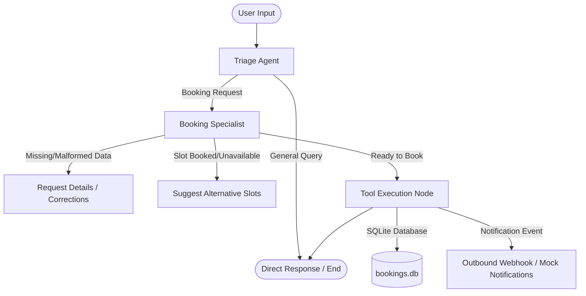

# Multi-Agent Scheduling Assistant with Tool Validation & Mock Notifications

An advanced, production-ready multi-agent scheduling assistant built with **LangGraph**, **LangChain**, **Streamlit**, and **Google Gemini**. It enables natural language appointment scheduling, validates date and time parameters, persists conversation context across restarts, and simulates background notifications.

---
## 🚀 Live Demo

The application is deployed and available here:

🔗 https://multi-agent-booking.onrender.com

### How to Test:
1. Open the live application.
2. Enter Gemini API key in the sidebar if required.
3. Try sample booking requests:

Examples:
- "Hello, how are you today?"
- "Book tomorrow at 5 PM"
- "Schedule an appointment on Friday"
- "Book a meeting and send confirmation"

The application supports:
- Multi-agent routing using LangGraph
- Calendar booking workflow
- Slot availability checking
- Mock notification triggering
- Persistent conversation memory
## Project Overview

The **Multi-Agent Scheduling Assistant** coordinates scheduling tasks by routing user requests to specialized agents:
- **Triage Agent**: Understands the user's intent. Routes appointment-related inquiries to the Booking Specialist and answers general conversation directly.
- **Booking Specialist**: Manages date normalization (e.g. converting "tomorrow" or "Friday" to `YYYY-MM-DD`), extracts parameters, validates schedules, and checks slot availability.
- **Tool Execution Node**: Safely handles reservations in a SQLite database and triggers mock outbound notifications to configured external webhooks.

---

## Architecture

The system's execution graph and integration points are structured as follows:



---

## Workflow Explanation

### 1. Agent Routing & Context Merging
- **Intent Routing**: The Triage Agent filters messages using a combination of whole-word keyword matching and structural heuristics. General greetings and chit-chat are answered immediately, avoiding unnecessary Specialist execution.
- **State Reducer**: LangGraph's state carries `booking_context` across nodes. A custom merge reducer prevents empty state updates from overriding previously collected fields, allowing incremental detail gathering.

### 2. Temporal Normalization & Parameter Extraction
- Heuristics or LLM extraction parses parameters (date, time, email).
- **Date Normalization**: Natural language relative dates (such as "today", "tomorrow", "Friday", or "next Tuesday") are normalized into standard ISO `YYYY-MM-DD` strings.
- **Time Normalization**: Recognizes human patterns (e.g. "5 PM", "10 AM", "10:30") and formats them to `HH:MM` 24-hour style (e.g., `17:00`).

### 3. Validation & Conflict Handling
- **Date & Time Boundaries**: Rejects past dates, malformed inputs (e.g., "invalid-date-string"), and out-of-bound times.
- **Slot Negotiation**: If the requested slot is already booked or falls outside available defaults (`09:00 - 16:00`), the assistant queries database availability and presents alternative open slots to the user.

### 4. Tool Execution & Memory Persistence
- **Try-Except Error Boundaries**: Prevent workflow crashes by catching database or connection exceptions.
- **SQLite Checkpointing**: LangGraph uses a persistent `SqliteSaver` checkpointer (`memory.db`) to ensure the conversation state survives page refreshes.

---

## Installation & Setup

### Prerequisites
- Python 3.9+
- SQLite

### Step 1: Clone and Setup Workspace
```bash
git clone https://github.com/Yamini8102005/multi-agent-booking.git
cd multi-agent-booking

# Create virtual environment
python -m venv .venv

# Activate virtual environment
# On Linux/macOS:
source .venv/bin/activate
# On Windows (PowerShell):
.venv\Scripts\Activate.ps1
```

### Step 2: Install Dependencies
```bash
pip install -r requirements.txt
```

### Step 3: Configure Environment Variables
Create a `.env` file in the root directory:
```env
GOOGLE_API_KEY=your_gemini_api_key
WEBHOOK_URL=https://webhook.site/your-unique-id
```

---

## Running the Application

### Streamlit Chat UI
Launch the interactive chat interface:
```bash
streamlit run app.py
```
> **Note**: If `GOOGLE_API_KEY` is not present in `.env`, the sidebar allows you to paste your Gemini API key at runtime. The app dynamically sets the key without saving it to disk.

---

## Testing Instructions

The codebase includes an automated test suite verifying all agent routing, temporal normalization, slot conflict negotiation, validation, and database saves.

To run the unit tests:
```bash
.venv\Scripts\python -m unittest test_booking.py
```

---

## Deployment Guide

### Deploying to Render
1. Create a new **Web Service** on Render.
2. Connect your GitHub repository.
3. Configure the following settings:
   - **Environment**: `Python`
   - **Build Command**: `pip install -r requirements.txt`
   - **Start Command**: `streamlit run app.py --server.port $PORT --server.address 0.0.0.0`
4. Add Environment Variables in Render dashboard:
   - `GOOGLE_API_KEY` (Optional, can be entered at runtime)
   - `WEBHOOK_URL` (For mock notifications)

### Deploying to Hugging Face Spaces
1. Create a new Space with the **Streamlit** SDK.
2. Push your repository files to the Space.
3. Set your secret keys (`GOOGLE_API_KEY`, `WEBHOOK_URL`) in the Space's Settings page.

### Deploying to Vercel
1. Set up Vercel serverless functions with a python runtime (using a custom configuration like `vercel.json` pointing to a WSGI or custom routing, or hosting the streamlit server). Note that for full state persistence, a managed cloud database or persistent disk is required, as serverless environments have ephemeral filesystems.